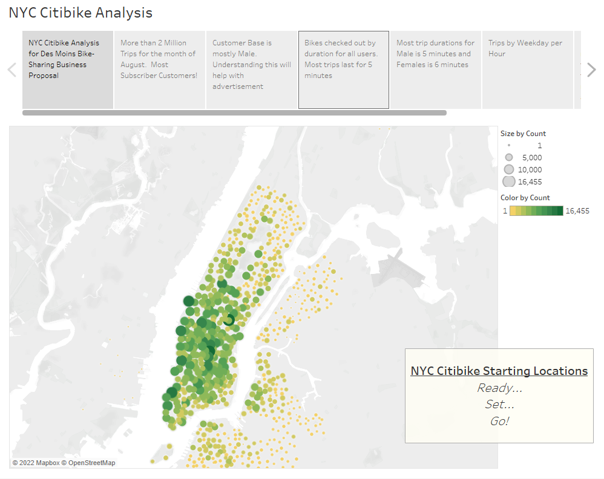
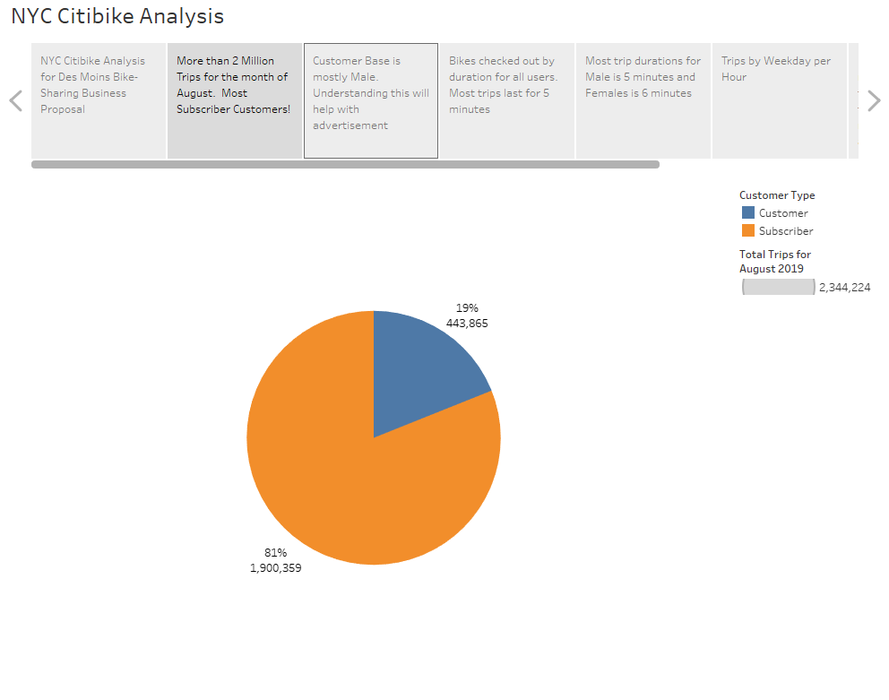
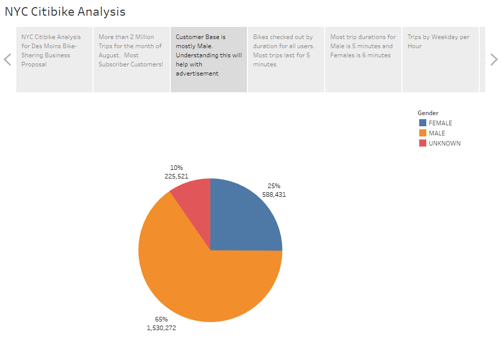
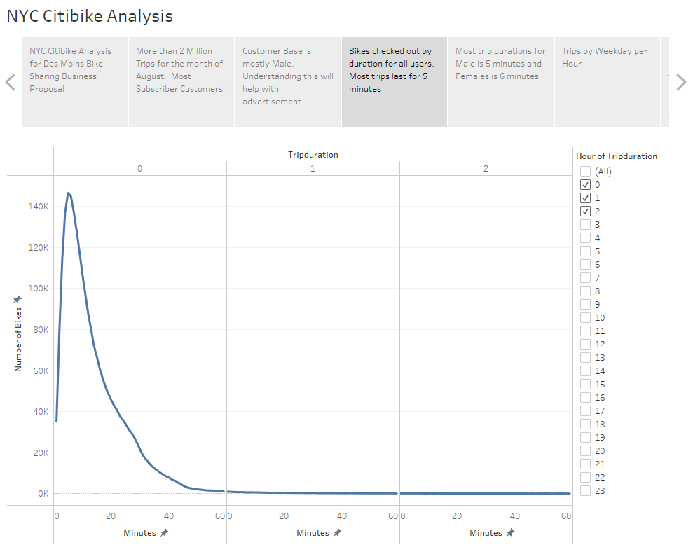
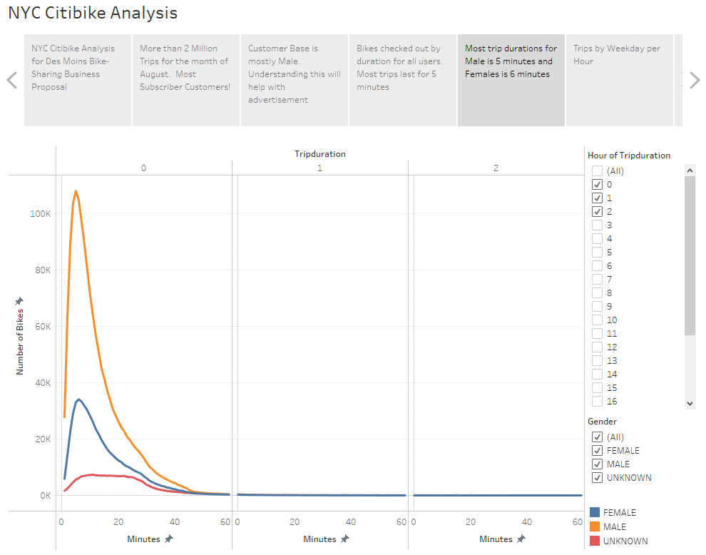
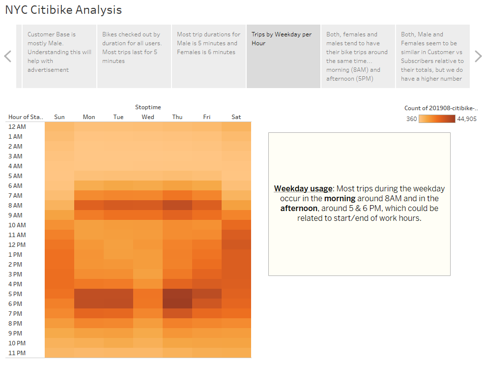
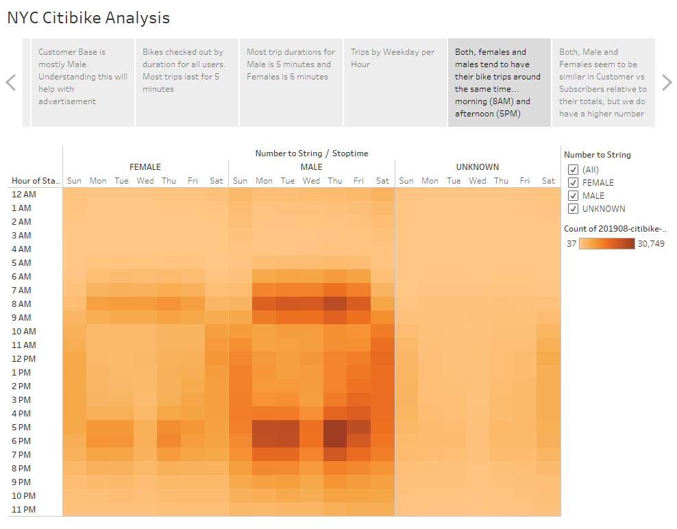
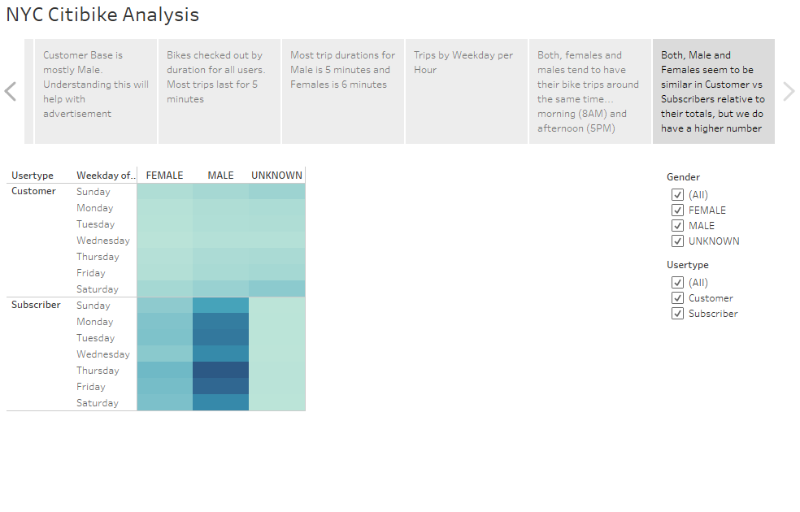

# bikesharing
Module 14: NY Citibike with Tableau

## Overview of Project
The purpose of this challenge was to perform a bike trip analysis using the knowledge obtained from module 14 for **Tableau** and basic knowledge with **Pandas** from previous modules.  The main reason for the bike trip analysis was to analyze and visualize the data to build convincing evidence that the new bike-sharing program is a solid business proposal.

The challenge consisted of the following deliverables:
- **Deliverable 1**: Change Trip Duration to a Datetime Format
    - **Pandas** was used to change the "tripduration" column from an integer (containing seconds) to a datetime datatype.  Once the data was converted/properly formatted, it was then exported/saved to CSV.
- **Deliverable 2**: Create Visualizations for the Trip Analysis
    - The new formatted data was imported into the **Tableau Desktop Public Edition** app (__version 2021.4.4 64-bit__).
    - Tableau was used to create the following visualization reports using line graphs and heatmaps:
        - Line Graph: "Checkout Times for Users"
        - Line Graph: "Checkout Times by Gender"
        - Heatmap: "Trips by Weekday per Hour"
        - Heatmap: "Trips by Gender (Weekday per Hour)"
        - Heatmap: "User Trips by Gender by Weekday"
- **Deliverable 3**: Create a Story and Report for the Final Presentation
    - Story: "NYC Citibike analysis" using **Tableau**
    - Additional worksheets from the module were added to the challenge.
    - Present/submit final presentation via GitHub and Tableau Public link

## Results
Below are screenshots from Tableau Story created from this challenge.  Also, here is my [**link to the Tableau Story**](https://public.tableau.com/views/Module14Challenge_16486957412620/NYCCitibikeAnalysis?:language=en-US&publish=yes&:display_count=n&:origin=viz_share_link)

### NYC Citibike Analysis screenshots:
- NYC Citybike Starting Locations: Grouping of all strip starting locations
    - 
- Customer Type: 2.3 million rides in the month of August 2019 with 81% of riders using subscription.
    -  
- Gender Breakdown: Most riders are Male, which helps us understand the clients, needs, advertisement, improvements, etc.
    - 
- Checkout Times for Users: Helps us understand the overall trip duration
    - 
- Checkout Times by Gender: Helps us understand the trip duration by gender
    -  
- Trips by Weekday per Hour: Most trips occur during the morning hours (around 8AM) and late afternoon (5-6PM)
    - 
- Trips by Gender (Weekday per Hour): The weekday per hour usage is similar for Males and Females.
    - 
- User Trips by Gender by Weekday: Similar trips are observed for Males and Females, but Males show more usage due to having more male riders than Females.
    -  

## Summary
On a high-level summary, it can be said that most riders are male, most of the riders use a subscription and during the weekday, most of the usage occurs in the morning hours and late afternoon.  As for male to female usage and trip durations, it can be said that they are relatively the same, but due to the riders being mostly male, they stand out the most.  Also, most of the trips have a short duration of about 5-6 minutes.

- Two additional visualizations suggested for future analysis are:
    - Subscription comparison between Males and Females
    - Top 10 Stations where most trips start and/or end.